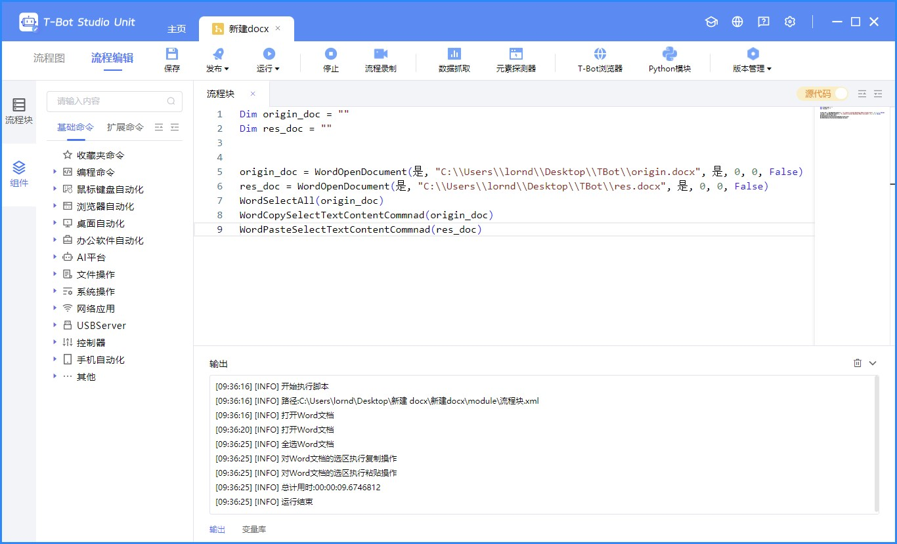
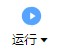

# 如何让生成的代码能够自动运行

## 打开 TBot Studio

首先打开 TBot Studio，打开（创建）一个项目，最好只包含一个流程块（因为没有测试过多流程块的项目是什么效果）。进入流程块的源代码编辑界面。

## 配置截图

自动输入代码的原理在于根据图像模板匹配要操作的区域。根据大家的电脑显示设置的不同，图像模板可能也会有所不同。所以需要同学们自行配置模板。

自动输入代码共分为三步：

1. 点击任务栏上的 TBot Studio 图标（需要关闭自动隐藏任务栏），打开 TBot Studio 。
2. 点击 TBot Studio 的代码编辑区域，清空原有代码，输入新的代码。
3. 点击运行按钮，运行代码。

打开 TBot Studio 的匹配模板放在 `utils/autotest/templates/open_tbot` 文件夹下，匹配任务栏中的 TBot 图标，进行点击操作。

输入代码的匹配模板放在 `utils/autotest/templates/input_code` 文件夹下，匹配 TBot Studio 的数据抓取按钮（在不同电脑上表现相同），向下偏移 150 个像素点，得到代码编辑区域。

点击运行按钮的匹配模板放在 `utils/autotest/templates/run` 文件夹下，匹配运行按钮，进行点击。

请注意：文件夹下可以存在多个模板，只要成功匹配到一个模板，就能够运行对应功能，所以**在添加模板时，不需要将原来的模板覆盖，直接添加新的图像文件即可**。
