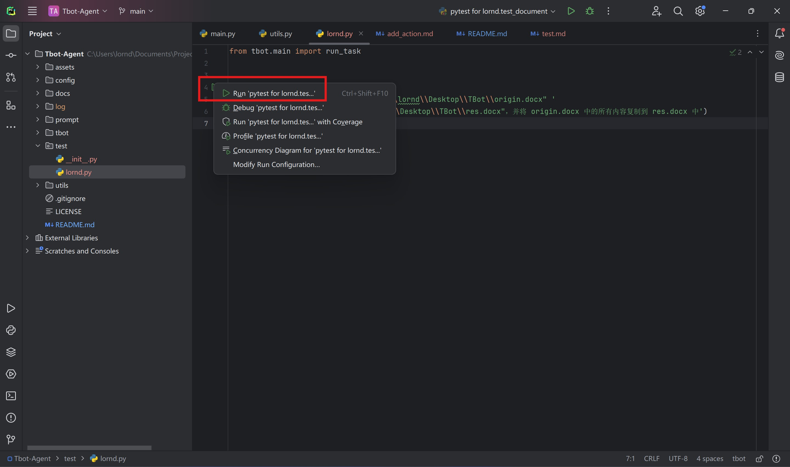

# 如何优雅地创建测试用例

## 配置 pytest 模板

首先，进入 Pycharm 的 `Edit Configurations` 界面。

点击 `Edit configuration templates`，进入模板配置。

选择 `Python tests > pytest`，并将 Working directory (工作目录) 设置为项目根目录。

## 新建测试文件

在 `test` 文件夹下，新建一个 `.py` 文件，文件名任意。在文件中定义任意以 `test` 开头的函数，左边就会出现一个三角形。

点击该三角形，即可方便地运行这个函数（进行测试）。

